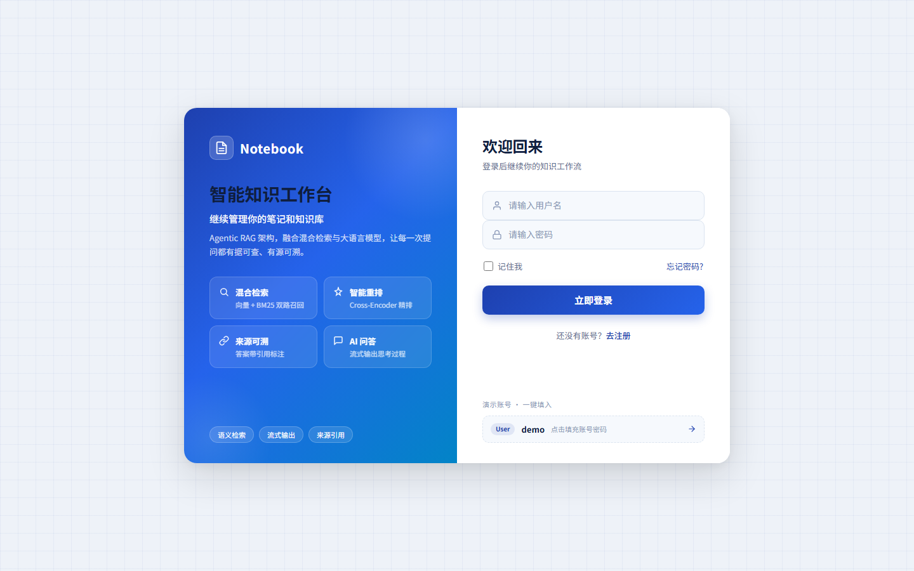
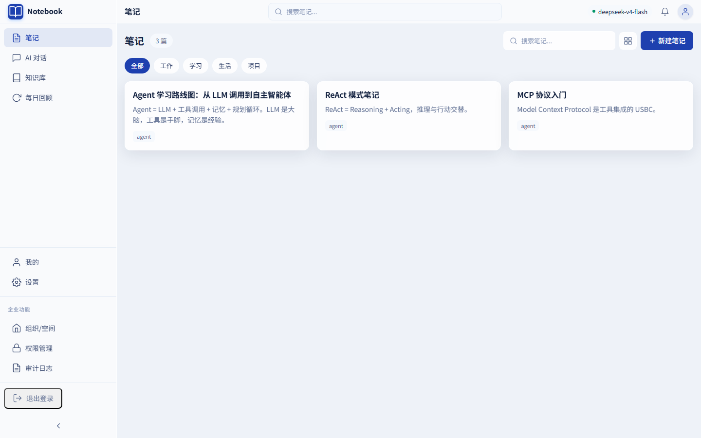
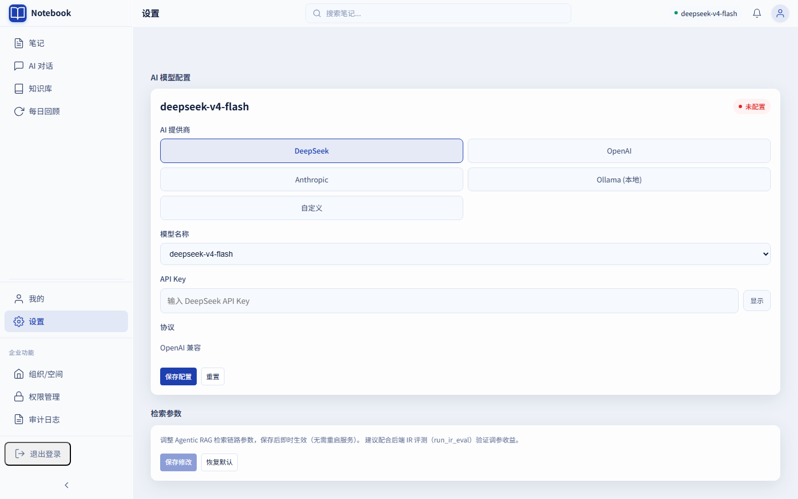
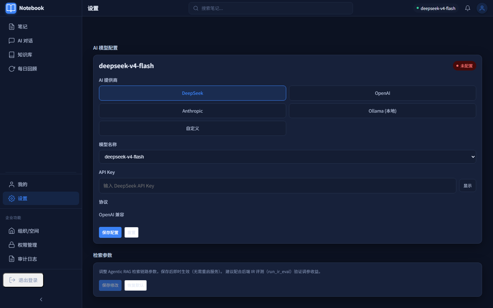

# Notebook — Agentic RAG 智能知识工作台

<div align="center">

**把笔记、文档、检索、回顾与 AI 问答整合为可追踪、可引用、可度量的个人知识工作流。**

基于 `Vue 3 + FastAPI + LangChain + Django + MySQL + Redis + ChromaDB` 构建
支持 `Ollama`、`DashScope` 与 `OpenAI 兼容接口`

[快速开始](#快速开始) · [系统架构](#系统架构) · [评测体系](#ir-指标评测recallatk--mrr--四阶段归因) · [API 文档](docs/API.md)

</div>

---

## 目录

- [项目定位](#项目定位)
- [界面预览](#界面预览)
- [相比传统 RAG 的提升](#相比传统-rag-的提升)
- [核心能力](#核心能力)
- [系统架构](#系统架构)
- [技术栈](#技术栈)
- [快速开始](#快速开始)
- [Docker 部署](#docker-部署)
- [配置说明](#配置说明)
- [关键 API](#关键-api)
- [测试与质量验证](#测试与质量验证)
- [项目结构](#项目结构)
- [GitHub 上传前检查](#github-上传前检查)
- [许可证与交流](#许可证与交流)

## 项目定位

Notebook 不是一个只把文档塞进向量库、再直接调用 LLM 的 RAG Demo。它面向长期使用的个人知识管理场景，将以下能力放在同一条工作流中：

```text
记录笔记 -> 管理文档 -> 异步索引 -> 统一检索 -> Agent 证据判断 -> 带引用回答 -> 反馈与持续优化
```

仓库由三个服务组成：

- `front/`：Vue 3 + Vite 前端，负责笔记编辑、知识库、AI 对话、会话、设置与用户界面；
- `backend/`：FastAPI + LangChain 主服务，负责 Agentic RAG、检索、文档索引、笔记、回顾、评估与健康检查；
- `DjangoUserService/`：Django 用户服务，负责注册、登录、JWT、用户资料与文件相关接口。

用户认证与 AI/RAG 业务分离，前后端和服务边界更清晰，也便于分别部署与扩展。

核心理念：**LLM 负责生成，检索链路负责证据，评估体系负责归因。** 把"感觉效果还行"这种主观判断，转化为能定位到具体环节的量化指标。

## 界面预览

| 登录（双栏品牌卡片） | 笔记工作台（玻璃拟态） |
|:---:|:---:|
|  |  |

| 设置（浅色） | 设置（深色·深蓝） |
|:---:|:---:|
|  |  |

> 界面采用深蓝科技风 + 玻璃拟态（Blueprint Grid + Glassmorphism），浅色/深色双主题。

## 相比传统 RAG 的提升

Notebook 已从传统的"检索后直接回答"升级为**受控 Agentic RAG**。这里的 Agent 是有明确边界、可观测、有限循环的检索编排，而非不可控的自由自治 Agent。

| 维度 | 传统 RAG 流程 | Notebook 的增强 |
|---|---|---|
| 检索决策 | 固定地检索后回答 | Adaptive-RAG 查询路由：按查询复杂度分 6 类（SIMPLE/FACTUAL/EXPLANATORY/COMPARATIVE/PROCEDURAL/EXPLORATORY），简单查询走轻量路径（跳过 HyDE） |
| 检索范围 | 单一知识库为主 | 统一检索知识库、笔记、混合范围与空间范围 |
| 证据不足 | 容易直接生成或回答不完整 | Evidence Grader 加权置信度评分（0.7×相关性+0.3×覆盖率），置信度分级（high/medium/low/none） |
| 检索失败 | 直接拒答 | CRAG 纠错回路：置信度极低时改写查询 + 扩大召回（top_k+3；用户指定的 space 范围保持不变） |
| 循环控制 | 通常没有显式限制 | 有最大补检索轮数与总超时，避免无界循环和成本失控 |
| 答案可信度 | 检索结果与答案关联较弱 | 基于 evidence 一次性生成（带 [n] 引用），并由 Citation Manager 管理引用 |
| 质量评估 | 无 | LLM-as-judge 四维度评分（faithfulness/completeness/relevance/overall），失败不影响主流程 |
| 过程体验 | 用户只看到最终答案 | SSE 实时返回 planning、retrieving、grading、citation 等阶段 + 检索链路可视化（置信度徽标/CRAG 标记） |
| 参数调优 | 改代码重启 | 检索参数运行时热更新（top_k/召回数/重排/置信度阈值，API 调整即时生效） |
| 效果度量 | 主观感觉 | IR 标准指标（Recall@K/Precision@K/MRR/拒答正确率）+ 四阶段归因 + 分主题得分 |
| 文档上传 | 上传、解析、向量写入强耦合 | 文件持久化与异步索引解耦，索引状态可见、可重试；文件名唯一性校验（按用户隔离） |
| 失败恢复 | 依赖人工排查 | `pending_index` 状态、手动 reindex 与 Celery Beat 定时补偿 |
| 可观测性 | 日志为主 | 记录 Agent run、step、耗时、引用数、质量评分和用户 feedback |
| 安全边界 | 基础登录鉴权 | 用户/空间隔离、7 类 Prompt Injection 防护、SQLAlchemy ORM 参数化查询、检索轮次限制、JWT 黑名单撤销 |

### Agentic RAG 工作流

```text
用户问题
  -> Guardrails（输入校验 / 7 类 Prompt Injection 防护 / 超时控制）
  -> Planner（Adaptive-RAG 查询路由：6 类分类，动态分配 top_k/HyDE/rerank）
  -> RetrievalService（向量+BM25 混合检索 + HyDE，用前端传入的 llm_config）
  -> Evidence Grader（加权置信度评分 + 置信度分级 high/medium/low/none）
  -> CRAG 纠错回路（置信度 none 时：改写查询 + 扩大召回 top_k+3 + 第二轮放宽评分）
  -> Answer Generator（基于证据一次性生成，带 [n] 引用 + LLM-as-judge 四维度评分）
  -> Citation Manager（归一化引用）
  -> SSE 输出（阶段事件 + 检索链路过程数据）+ Agent Run/Step/Feedback 记录
```

## 核心能力

### 知识与笔记

- **智能笔记管理**：创建、编辑、删除、浏览、分类筛选和基础组织管理；
- **Markdown 写作体验**：内置 Markdown 编辑与渲染、快捷工具栏、标签展示；
- **AI 写作辅助**：联机补全、续写、扩写、摘要等；
- **间隔回顾**：每日回顾能力，帮助把记录转化为长期记忆；
- **会话管理**：持久化聊天会话与多轮上下文。

### 文档知识库与索引治理

- 支持 `txt`、`pdf`、`md`、`pptx`、`docx` 等文档；
- 上传文件先安全持久化，再由后台任务解析、切片和向量化；
- 索引状态覆盖 `uploaded`、`parsed`、`pending_index`、`indexing`、`indexed`、`index_failed`；
- 列表可查看索引状态、切片数、失败信息；
- 支持按 `document_id` 删除、按旧文件名兼容删除、重新索引；
- Celery Beat 会定时扫描 pending 文档，补偿未完成索引。

### Agentic RAG 对话

- Adaptive-RAG 查询路由：6 类分类，简单查询走轻量路径；
- `knowledge`、`notes`、`all` 和 `space:{space_id}` 统一检索范围；
- 向量+BM25 混合检索 + HyDE（优先使用前端传入的 LLM 配置）；
- 证据去重与相邻片段合并，降低上下文冗余；
- Evidence Grader 加权置信度评分 + 置信度分级（high/medium/low/none）；
- CRAG 纠错回路：置信度极低时改写查询并扩大召回（top_k+3）；
- 基于证据一次性生成回答（带 [n] 引用）+ LLM-as-judge 四维度质量评分；
- SSE 流式返回阶段进度、答案、引用与检索链路过程数据（计划/召回/置信度/CRAG 标记）；
- **检索链路可视化**：对话页右栏以手风琴形式暂存最近 10 组问答的引用来源、检索过程与相关笔记（跨路由刷新保留）；
- **检索参数运行时热更新**：top_k 基准、向量召回数、重排倍数/开关、置信度阈值等 8 项参数即时生效，带范围校验与审计日志；
- Agent 运行、步骤、反馈的持久化记录；
- 7 类 Prompt Injection 防护、用户/空间级检索隔离、检索轮次限制。

### RAG 效果评测体系

- **IR 标准指标**：Recall@K / Precision@K / MRR / 拒答正确率；
- **四阶段归因**：向量单路 / BM25 单路 / 混合 / 混合+重排 分别评测，回答"融合与精排是否真的带来增益"；
- **分主题得分**：定位哪类知识检索质量偏低；
- **108 条结构化评测集**：96 可答 / 12 不可答 / 10 大主题各≥5 条 / 跨文档 / 边界用例，
  规模按统计置信度确定（p≈0.95 时 95% CI 半宽约 ±4.4pp），不靠数量硬凑；
- **标注守护**：schema、出处存在性、关键词⊆出处内容、禁答词∉语料、覆盖结构由 CI 测试自动校验；
- **评测驱动修复**：108 条评测第一轮即定位出 BM25 中文分词失效（recall 0.60），
  jieba 分词修复后 BM25 0.94、hybrid 由负增益转正增益（详见 `backend/evals/README.md`）；
- 评测语料与业务数据隔离，结论可复现。

### 模型与部署

- 支持 `OLLAMA`、`ALIYUN`（DashScope）与 `OPENAI` 兼容接口；
- 前端可传入动态模型配置；未传入时后端使用环境变量中的默认配置；
- 支持本地运行、Docker Compose 与健康检查；
- MySQL、Redis、ChromaDB、Celery worker/beat 组成完整运行闭环。

## 系统架构

```text
Browser
  |
  v
front/ (Vue 3 + Vite + Vant · 深蓝玻璃拟态 UI)
  |\
  | \-- /user, /file --------------------------> DjangoUserService/ (Django)
  |                                             |-- 注册 / 登录 / JWT（黑名单撤销）
  |                                             \-- 文件相关接口
  |
  \----- /api/v1/* --------------------------> backend/ (FastAPI)
                                                |-- Agent Router / SSE（阶段事件 + 检索链路过程数据）
                                                |-- AgentGraph (自研状态图)
                                                |   |-- Planner (Adaptive-RAG 查询路由)
                                                |   |-- RetrievalService (向量+BM25+HyDE)
                                                |   |-- Evidence Grader (置信度分级)
                                                |   |-- CRAG 纠错回路
                                                |   |-- Answer Generator (一次性生成+LLM-as-judge)
                                                |   \-- Citation / Guardrails
                                                |-- DocumentIndexService (文件名唯一性校验)
                                                |-- RuntimeConfig (检索参数热更新)
                                                |-- MySQL: 文档索引、会话、Agent Run/Step/Feedback
                                                |-- Redis + Celery: 异步索引、自动标签与补偿任务
                                                \-- ChromaDB: 向量检索
```

## 技术栈

| 层级 | 技术 |
|---|---|
| 前端 | Vue 3、Vite、Vant 4、Vue Router、Pinia、Vue I18n、ByteMD、Axios、Playwright |
| UI 风格 | 深蓝科技风、玻璃拟态（Blueprint Grid + Glassmorphism）、浅色/深色双主题 |
| API 与编排 | FastAPI、Pydantic、LangChain、SSE、统一 `/api/v1` 版本管理 |
| Agentic RAG | Adaptive-RAG 查询路由、统一检索（向量+BM25+HyDE）、Evidence Grader（置信度分级）、CRAG 纠错回路、Answer Generator（一次性生成+LLM-as-judge）、Citation Manager、Guardrails |
| 评测 | Recall@K / Precision@K / MRR / 拒答正确率、四阶段归因、分主题得分、108 条标注集 CI 守护 |
| 数据与检索 | MySQL、SQLAlchemy（ORM 参数化查询）、aiomysql、Redis、ChromaDB、BM25（jieba 中文分词） |
| 异步任务 | Celery、Redis、Celery Beat（文档索引补偿 + 笔记自动标签） |
| 用户服务 | Django、Django REST Framework、drf-yasg、JWT（Redis 黑名单） |
| 模型接入 | OpenAI-compatible（DeepSeek 等）、DashScope、Ollama、Anthropic |

## 快速开始

### 环境要求

| 环境 | 建议版本 |
|---|---|
| Python | 3.12+ |
| Node.js | 20+ |
| uv | 已安装 |
| MySQL | 8.x |
| Redis | 7.x |
| Docker | 可选 |
| Ollama | 使用本地模型时可选 |

### 1. 克隆项目

```bash
git clone <your-repo-url>
cd Notebook
```

### 2. 安装依赖

```powershell
cd DjangoUserService
uv sync

cd ..\backend
uv sync

cd ..\front
npm ci
```

> 若首次安装后没有 lockfile 对应依赖，使用 `npm install`；常规 CI/本地复现优先使用 `npm ci`。

### 3. 配置环境变量

```powershell
Copy-Item backend/.env.example backend/.env
Copy-Item DjangoUserService/.env.example DjangoUserService/.env
```

至少检查以下配置：

- `backend/.env`：`SECRET_KEY`、MySQL、Redis（含 `REDIS_PASSWORD`）、`DJANGO_API_URL`、`CORS_ORIGINS`、`LLM_TYPE` 及对应模型 Key/URL；
- `DjangoUserService/.env`：`JWT_SECRET_KEY`、数据库、Redis Cache（`REDIS_CACHE_URL` 带认证）、Celery broker/backend；
- `SECRET_KEY` 与 `JWT_SECRET_KEY` 必须一致（JWT 跨服务契约见 [docs/JWT_CONTRACT.md](docs/JWT_CONTRACT.md)）；
- 本地 `.env` 含敏感信息，**不要提交到 Git**。

### 4. 执行数据库迁移

```powershell
# Django 用户服务
cd DjangoUserService
uv run python manage.py migrate

# FastAPI 业务库（Alembic）
cd ..\backend
uv run alembic upgrade head
```

> 表结构变更应新增 Alembic revision；不要依赖应用启动时自动建表。

### 5. 启动基础设施和可选模型服务

```powershell
net start mysql80
redis-server
```

如使用本地 Ollama：

```bash
ollama serve
ollama pull qwen3.5:0.8b
ollama pull qwen3-embedding:0.6b
```

### 6. 启动服务与异步任务

在五个终端中分别执行：

```powershell
# 终端 1：Django 用户服务
cd DjangoUserService
uv run python manage.py runserver 8001

# 终端 2：FastAPI 主服务
cd backend
uv run uvicorn main:app --reload --port 8002 --host 127.0.0.1

# 终端 3：Celery worker（文档索引等异步任务）
cd backend
uv run celery -A app.tasks.celery_app:celery_app worker --loglevel=info

# 终端 4：Celery Beat（pending_index 补偿扫描）
cd backend
uv run celery -A app.tasks.celery_app:celery_app beat --loglevel=info

# 终端 5：前端
cd front
npm run dev
```

默认访问地址：

- 前端：`http://127.0.0.1:3076`
- FastAPI 文档：`http://127.0.0.1:8002/api/v1/docs`
- Django Swagger：`http://127.0.0.1:8001/docs/`

## Docker 部署

仓库提供 `.env.example`、`docker-compose.yml`、`docker-start.bat` 和 `docker-start.sh`。

### 1. 准备根目录配置

```powershell
Copy-Item .env.example .env
```

替换至少以下变量：

- `MYSQL_ROOT_PASSWORD`
- `MYSQL_PASSWORD`
- `REDIS_PASSWORD`
- `JWT_SECRET_KEY`

需要云端模型时，按使用的模型供应商补充 `DASHSCOPE_API_KEY`、`OPENAI_API_KEY` 等变量。

### 2. 启动容器

```bash
docker compose up -d --build
```

或在 Windows 直接运行：

```powershell
.\docker-start.bat
```

Compose 会启动 MySQL、Redis、FastAPI、Celery worker、Celery Beat、Django 和前端服务。默认端口：

- 前端：`http://127.0.0.1:3076`
- FastAPI：`http://127.0.0.1:8002`
- Django：`http://127.0.0.1:8001`

## 配置说明

### LLM 与 Embedding

后端支持以下模型接入模式：

- `LLM_TYPE=OLLAMA`：本地模型；
- `LLM_TYPE=ALIYUN`：阿里云百炼 / DashScope；
- `LLM_TYPE=OPENAI`：OpenAI 兼容接口。

知识库需要可用的 embedding 配置。请在上传文档后确认文档最终状态为 `indexed` 且 `chunk_count > 0`；模型凭据、网络、额度或向量库异常会导致 `index_failed` 或 pending 状态。

默认 Chroma 配置在：

```text
backend/app/config/chroma.yaml
```

默认关键参数：

- 支持格式：`txt`、`pdf`、`md`、`pptx`、`docx`；
- 默认检索 `k=5`；
- 默认 `chunk_size=500`；
- 默认 `chunk_overlap=60`。

> 注意：`chunk_size` / `chunk_overlap` 是索引期参数，修改后需重新索引才能对已上传文档生效。运行期参数（top_k/召回数/重排/阈值）已支持热更新，见"检索参数热更新"。

### 检索参数热更新

8 项检索期参数支持通过 API 运行时调整、即时生效（无需重启）：

| 参数 | 默认 | 范围 | 说明 |
|---|---|---|---|
| `retrieval.top_k_baseline` | 5 | 3–15 | 检索 top_k 基准值 |
| `retrieval.chroma_k` | 6 | 3–20 | 向量检索召回数量 |
| `retrieval.rerank_candidate_multiplier` | 3 | 2–5 | 重排候选集倍数 |
| `retrieval.rerank_enabled` | true | — | Cross-Encoder 重排序开关 |
| `grader.min_relevance` | 0.3 | 0.1–0.5 | 证据最低相关性阈值 |
| `grader.confidence_high` | 0.7 | 0.5–0.95 | 置信度 high 分级阈值 |
| `grader.confidence_medium` | 0.4 | 0.2–0.7 | 置信度 medium 分级阈值 |
| `grader.confidence_low` | 0.1 | 0.0–0.4 | 置信度 low 分级阈值 |

接口：`GET/PUT /api/v1/admin/runtime-config`、`POST /api/v1/admin/runtime-config/reset`（变更写入审计日志）。前端设置页提供可视化调整面板。索引期参数（chunk 大小等）不纳入热更新，避免误导。

### 数据隔离与安全

- Django 用户服务负责用户认证，FastAPI 用 JWT 识别用户（黑名单撤销跨服务生效）；
- 知识库、笔记、会话、Agent run 等数据按用户维度隔离；
- 文件名唯一性校验（按用户隔离，同名文件拒绝上传并返回 409）；
- Agent 检索还会按 `space_id` 约束范围；
- 7 类 Prompt Injection 防护（角色注入/越狱指令/特殊 Token）；
- 所有数据库查询通过 SQLAlchemy ORM 参数化执行，防止 SQL 注入；
- Agent 工具为只读，且有输入防护和检索轮次上限；
- `.env`、数据目录、日志、虚拟环境和构建产物已通过 `.gitignore` 排除。

## 关键 API

完整接口请以 FastAPI Swagger 为准：`/api/v1/docs`。详见 [docs/API.md](docs/API.md)。

### Agentic RAG

| 方法 | 路径 | 说明 |
|---|---|---|
| `POST` | `/api/v1/chat/agent/query/stream` | SSE 流式 Agent 查询 |
| `POST` | `/api/v1/chat/agent/query` | 非流式 Agent 查询 |
| `GET` | `/api/v1/chat/agent/runs/{run_id}` | 查询一次 Agent 运行记录 |
| `GET` | `/api/v1/chat/agent/runs` | 查询 Agent 运行列表 |
| `POST` | `/api/v1/chat/agent/feedback` | 提交答案评分与反馈 |

SSE 事件包括：`started`、`planning`、`retrieving`（含检索计划）、`retrieval_completed`（含召回摘要）、`grading_evidence`、`rewriting_query`（含 CRAG 标记与改写结果）、`generating_answer`（含置信度评估）、`citation`、`completed`、`error`。

### 知识库索引管理

| 方法 | 路径 | 说明 |
|---|---|---|
| `POST` | `/api/v1/knowledge/add/single/v2` | 上传单个文档并创建异步索引任务 |
| `POST` | `/api/v1/knowledge/add/multiple/v2` | 批量上传并创建索引任务 |
| `GET` | `/api/v1/knowledge/index-status` | 查询文档索引状态、切片数与失败信息 |
| `POST` | `/api/v1/knowledge/{document_id}/reindex` | 重新提交索引 |
| `DELETE` | `/api/v1/knowledge/documents/{document_id}` | 删除 v2 文档、索引元数据和向量数据 |

### 运行时配置

| 方法 | 路径 | 说明 |
|---|---|---|
| `GET` | `/api/v1/admin/runtime-config` | 查看全部检索参数（当前值/默认值/范围） |
| `PUT` | `/api/v1/admin/runtime-config` | 批量更新参数（即时生效，写入审计日志） |
| `POST` | `/api/v1/admin/runtime-config/reset` | 重置参数为默认值 |

## 测试与质量验证

### 后端测试

```powershell
cd backend
uv run pytest tests
```

覆盖：Agentic RAG 回归、检索权限隔离、评测 grader、IR 指标纯函数、评测集标注质量守护（108 条）、BM25 中文分词守护、运行时配置校验与读取点、SSE 事件字段、限流、JWT 契约等（287+ 用例）。

### Agentic RAG 定向回归测试

```powershell
cd backend
uv run pytest -q `
  tests/test_agentic_rag_regressions.py `
  tests/test_p0_fixes.py `
  tests/test_agent_sse_trace.py `
  tests/test_runtime_config.py
```

### IR 指标评测（Recall@K / MRR / 四阶段归因）

对同一批评测 case 以 向量单路 / BM25 单路 / 混合 / 混合+重排 四种模式分别检索，
输出各阶段 Recall@K / Precision@K / MRR 对比、拒答正确率与分主题得分，定位"融合与精排是否带来增益"：

```powershell
cd backend
uv run python -m evals.runners.run_ir_eval --top-k 3          # 需要可用 embedding 模型
uv run pytest tests/test_eval_ir_metrics.py -q                # CI 纯函数测试（无外部依赖）
```

指标定义与基线数据详见 `backend/evals/README.md`。

### 前端构建与 E2E

```powershell
cd front
npm run build
npm run test:e2e
```

如需真实后端全链路 E2E，请显式传入本地测试账号：

```powershell
cd front
$env:E2E_FULL_STACK="true"
$env:E2E_USERNAME="your-local-user"
$env:E2E_PASSWORD="your-local-password"
npm run test:e2e:full -- --project=chromium
```

## 项目结构

```text
Notebook/
├── backend/
│   ├── app/
│   │   ├── agentic/           # AgentGraph、Adaptive-RAG 规划、证据评估、CRAG 纠错、引用和安全边界
│   │   ├── rag/               # 统一检索、向量库、重排序、文本切分与文档处理
│   │   ├── services/          # 文档索引、笔记、回顾等服务
│   │   ├── tasks/             # Celery worker / Beat 任务
│   │   ├── models/            # document_index、agent_run、runtime_config 等数据模型
│   │   ├── repositories/      # 数据访问层
│   │   ├── core/              # 限流、审计、运行时配置、请求上下文
│   │   └── router/            # Chat、Agent、Knowledge、RuntimeConfig 等 API
│   ├── alembic/               # MySQL schema migrations
│   ├── evals/                 # Agent/RAG 评估框架（IR 指标 + 四阶段归因）
│   │   ├── cases/             # 评测集（含 ir_eval_cases.jsonl 标注）
│   │   ├── graders/           # IR 指标、关键词、工具调用等 grader
│   │   ├── runners/           # 评测 runner
│   │   └── seed_docs/         # 评测语料（与业务数据隔离）
│   ├── tests/                 # 后端测试
│   └── main.py
├── front/
│   ├── src/
│   │   ├── pages/             # 聊天、知识库、笔记等页面
│   │   ├── components/        # QaHistoryPanel、RetrievalTrace 等组件
│   │   ├── services/          # API 与 SSE 客户端封装
│   │   ├── store/             # Pinia 状态管理（含 qaHistory 持久化）
│   │   └── composables/       # 组合式逻辑
│   └── tests/                 # Playwright E2E
├── DjangoUserService/
│   ├── apps/                  # 用户、文件与工具模块
│   └── DjangoUserService/     # Django 配置
├── docs/
│   ├── API.md                 # 后端 API 文档
│   ├── JWT_CONTRACT.md        # JWT 跨服务契约
│   └── screenshots/           # 界面截图
├── docker-compose.yml
└── README.md
```

## GitHub 上传前检查

在推送前建议执行：

```powershell
# 前端构建
cd front
npm run build

# 后端测试
cd ..\backend
uv run pytest tests

# Django 测试
cd ..\DjangoUserService
uv run python manage.py test apps.user apps.file --settings=DjangoUserService.test_settings
```

并确认：

- [ ] `.env`、私钥、真实 API Key、运行日志、Chroma 数据、上传文件、虚拟环境和 `node_modules` 没有进入暂存区；
- [ ] `backend/.env.example`、`DjangoUserService/.env.example` 与当前需要的配置项一致，但不含真实密钥；
- [ ] 数据库迁移文件已纳入提交，且可以在干净数据库运行 `alembic upgrade head`；
- [ ] Docker Compose 可以启动 `backend`、`celery-worker` 与 `celery-beat`；
- [ ] 至少完成一次文档上传 -> `indexed` -> 可检索 -> 删除 的真实环境验收；
- [ ] README 中的仓库地址、许可证和联系方式按你的公开仓库信息补全。

## 许可证与交流

当前仓库尚未声明许可证。公开发布前建议添加 `LICENSE`（例如 MIT 或 Apache-2.0），并在此处补充许可证说明。

问题、建议和贡献欢迎通过 GitHub Issues 与 Pull Requests 交流。
